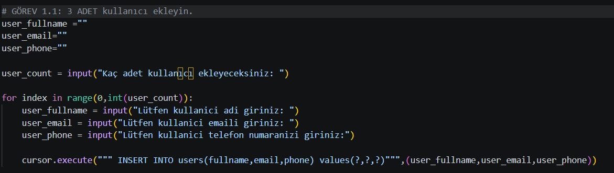
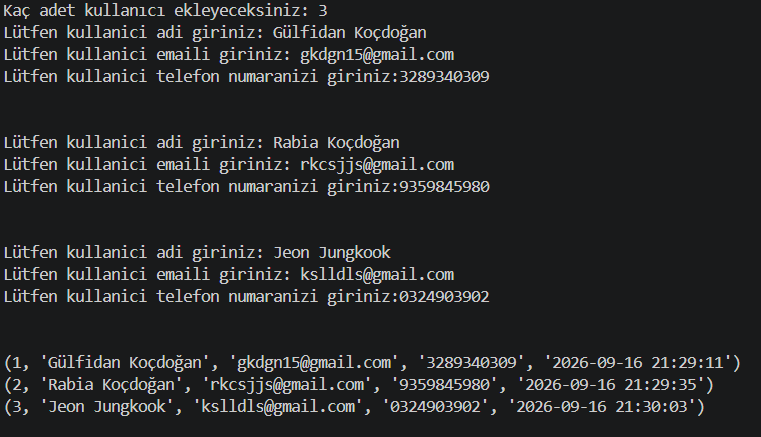
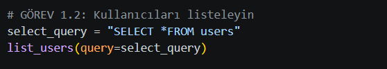
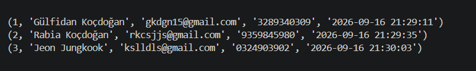
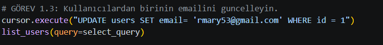
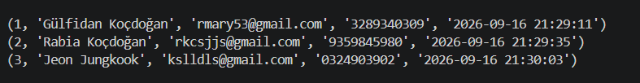
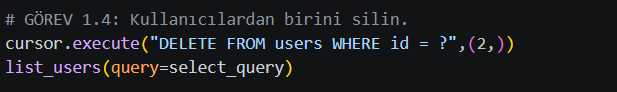
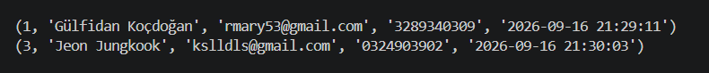
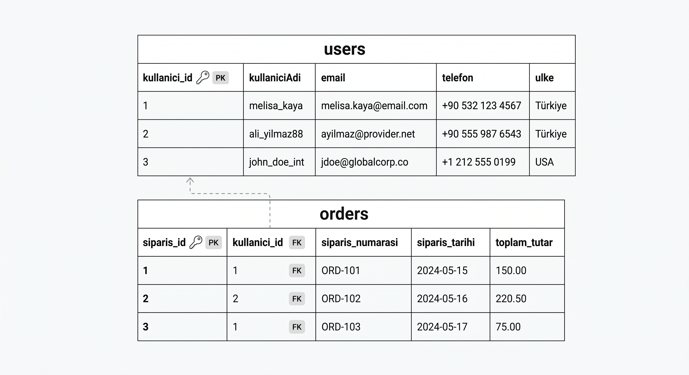

## Sqlite Ödevi

### Görev 1.1: Veri tabanı ve tablo oluşturma

local_shoppier.db adında bir veri tabanı oluşturuldu. Bu veri tabanına users adında tablo eklendi. Yapılan işlemlere ait kod bloğuna Şekil 1'de yer verildi.

-> Veri tabanı = local_shoppier.db

-> Tablo = users

#### Şekil 1.Veri tabani ve Tablo Oluşturma Kodları

### GÖREV 1.2: 3 adet kullanıcı ekleme

Bu görevde users tablosuna kaç adet kullanıcı eklenmesi gerektiği bilgisi dinamik bir şekilde alındı ardından bu kullanıcı sayısı kadar işlem yapan bir for döngüsü kuruldu. For döngüsü içerisinde de users tablosunda boş bırakılması yasak yani NOT NULL olan özellikler yine dinamik olarak alındı. Alınan bu veriler users tablosuna kaydedildi. Yapılan işlemleri gerçekleştiren python kodlarına ve çalışan koda ait çıktılara Şekil 2'de yer verildi.

#### Şekil 2.Kullanıcı Ekleme Kaynak Kodu Çıktısı

### GÖREV 1.3: Kullanıcıları Listeleme

users tablosunda bulunan verileri çekmek için kullanılan sorgu koduna Şekil 3'te yer verilmiştir.

#### Şekil 3.Kullanıcı Listeleme Sorgu Kodu Çıktısı

### GÖREV 1.4: Kullanıcının email bilgisini güncelleme

Ön Bilgi: Bir veri tabanında tabloda bulunan varlığa ait bir alan yani özellik güncellenmek isterse UPDATE komutu kullanılır. 

users tablosunda belirli bir kullanıcıya ait email bilgisini güncelleme sorgusu koduna Şekil 4'te yer verilmiştir. 

#### Şekil 4.Varlık örneğine ait özelliğin güncellenmesindeki sorgu kodu

Güncellendikten sonraki kullanıcı listesine ise Şekil 5'te yer verilmiştir.

#### Şekil 5.Güncel kullanıcı listesi

### GÖREV 1.5: Kullanıcının tablodan silinmesi
Ön Bilgi: Bir veri tabanında tabloda bulunan varlık örneğini yani kullanıcıyı silmek için kullanılan komut DELETE komutudur. 

users tablosunda belirli bir kullanıcıyı silmede kullanılan sorgu koduna Şekil 6'da yer verilmiştir.

#### Şekil 6.Kullanıcıyı silmede kullanılan sorgu kodu

Silme işlemi gerçekleştikten sonra güncel kullanıcı listesi çıktısıne ise Şekil 7'de yer verilmiştir.

#### Şekil 7.Silme işleminden sonraki güncel kullanıcı listesi

#
### GÖREV 2:
Kullanıcılara ait users tablosuna ve kullanıcıların siparişlerinin bulunduğu tabloya şekil 8'de yer verilmiştir.

#### Şekil 8.Users ve Orders Tablolari

#### INNER JOIN Gereksinimi açıklama
'users' tablosundan kullaniciAdi, email bilgisi çekilip listelenmek istiyor.

'orders' tablosundan ise ilgili kullanıcıya ait siparişin sipariş numarası alınıp listelenmek istiyor.

Bu iki tablodan alınması gereken alanları listeleyebilmek için de iki tablo arasında bir ilişki kurulması gerekir. Yani bir tabloda melisa_kaya adlı kullanıcısı varsa diğer tabloda melisa_kaya adlı kullanıcısına ait kayıt/satır eşleştirilip o satırdaki istenen alanlar iki tablodan alınıp ekrana çıktı olarak verilmelidir.
İşte bu isteği gerçekleştirmek için kullanılan komut ise INNER JOIN'dir.

#### SQL INNER JOIN SORGUSU

    SELECT users.kullaniciAdi,users.email,orders.siparis_numarasi FROM users 
    INNER JOIN orders 
    ON users.kullanici_id = orders.kullanici_id

#### SORGUNUN Parça Parça Açıklanması

     SELECT users.kullaniciAdi, users.email, orders.siparis_numarasi

    Açıklama:   Listelenmek istenen alanlar hangi tabloda bulunuyorsa burada tabloAdi.sutunAdi şeklinde belirtilmeli.
    
    FROM users

    Açıklama: Sorguda ilk dikkate alınan tablomuz users tablosu

    INNER JOIN orders 

    Açıklama: orders tablosunu da bu işleme tabi tut yani ilişkilendir.

    ON users.kullanici_id = orders.kullanici_id

    Açıklama: iki tablodaki değerleri karşılaştır .Eşit olanları eşleştir ve ilgili satırı geri döndür. Geriye dönen satırdanda geriye en başta istenen alanları döndür.

    Örneğin : users tablosundan 2.satır + orders tablosundan 2.satır döner. Ardından users tablosundan dönen satırdan kullaniciAdi,email orders tablosundan dönen satırdan siparis_numarasi alani dikkate alınır.

### GÖREV 3: MOBİL UYGULAMA GÜVENLİĞİ

### GÖREV 3.1:Ekran görüntüsü ve ekran kaydı

    Kullanıcıya ait banka/kredi kartı bilgilerinin (kart no,cvv,bakiye) ekran görüntüsünün veya ekran kaydının sızmasını engeller. Aynı zamanda kötü niyetli uygulamaların verileri çalmasını engeller.

    Android : WindowManager/FlagSecure
    IOS: UIScreen.isCaptured
    Ekran simsiyah blur görünür.

### GÖREV 3.2:Overlay Saldırısı
     
    Kullanıcı mobil bankacılık uygulamasını açar ve para transferi işlemlerinde havale işlemlerinde gerçekten o sayfada işlem yaptığını sanar ancak durum burada farklıdır. Kötü niyetli kişiler gerçek ekranın üzerine birebir aynı arayüzü yerleştirir. Kullanıcı işlemi tamamlamak için onayla tuşuna basınca saldırganın belirlediği ibana para transferi gerçekleşir. Ya da kart bilgileri kullanıcıya geçer. Kullanıcı o an bunu fark etmez.
    
### GÖREV 4: ROOT/JAILBREAK RİSKİ
    Root(android) veya Jailbreak(IOS), işletim sisteminin güvenlik kısıtlamalarını ortadan kaldırır.

    Uygulama izolasyon koruması devre dışı kalır; diğer uygulamalar bankacılık uygulamasının dosyalarına ve belleğine erişebilir.

    Kötü niyetli uygulamalar yönetici (root) yetkisiyle çalışarak şifreleme anahtarlarını, token'ları ve oturum bilgilerini okuyabilir.

    SSL pinning, tamper detection gibi korumalar baypas edilebilir; trafik dinlenebilir.

#### Örnek:
    Saldırgan, root'lu cihaza kötü niyetli bir uygulama yükler. Bu uygulama, bankacılık uygulamasının /data/data/com.banka.app/ dizinindeki oturum token'ını veya shared_prefs içindeki şifrelenmiş kimlik bilgilerini root yetkisiyle okur. Böylece kullanıcının şifresini bilmeden hesabına erişip para transferi yapabilir. Normal bir cihazda sandbox bu erişimi engellerdi.

### GÖREV 5: SQLite ve şifreleme

#### Normal Sqlite:
     
     Veritabanı şifresiz olduğu için kullanıcıya ait bilgiler(şifre,kart no,cvv vb.) düz yazı formatında gözükür. Cihazın kaybolması durumunda root işlemi yapılırsa kötü niyetli kişi veri tabanı dosyasına erişip kopyalayıp SQlite ile açabilir ve tüm bilgileri doğrudan okuyabilir yani anlaşılır formdadır çünkü şifrelenmemiştir.
       
#### SQLCipher Kullanıldığında

     SQLCipher veritabanının tamamını AES ile şifreler. Veriler diske yazılırken şifrelenir, okunurken çözülür. Saldırgan dosyayı çalsa bile anahtar olmadan içeriği göremez.Yani kısaca: dosya çalınsa bile veriler okunamaz hale gelir. Anahtar güvenli bir yerde saklanırsa koruma daha da güçlenir. Sadece anlamasız veriler görür.
### GÖREV 6.Access Token / Refresh Token
#### Access Token:
    Kullanıcının API'ye istek yaparken kimliğini kanıtlayan kısa ömürlü anahtardır. Süresi dolunca kullanılamaz.

#### Refresh Token:
    Access Token'ın süresi bittiğinde yeni bir Access Token almak için kullanılan uzun ömürlü anahtardır.

#### Access Token neden kısa süreli?
    Çalınırsa saldırganın elinde çok kısa süre kalır, süresi dolunca işe yaramaz. Bu yüzden riski düşüktür, kısa tutulur.

#### Refresh Token neden daha güvenli yerde saklanmalı?
    Uzun süre geçerli olduğu için çalınırsa saldırgan sürekli yeni Access Token alıp hesaba erişebilir. Bu yüzden Keystore/Keychain gibi güvenli alanda tutulur, normal yerde bırakılmaz.

#### Çıkışta neden iptal edilir?
    Kullanıcı çıkış yaptığında Refresh Token hâlâ geçerli olursa, biri onu ele geçirip tekrar giriş yapmış gibi yeni token alabilir. İptal edilince o token bir daha çalışmaz, oturum tamamen kapanır.

