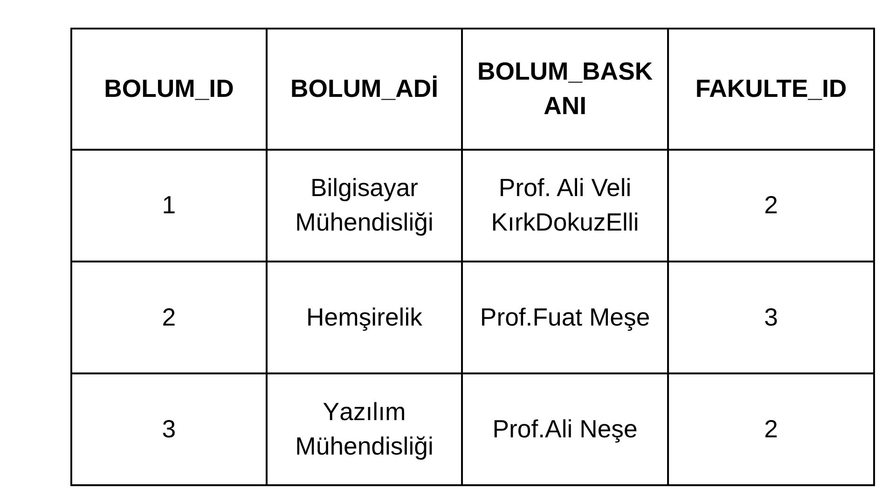
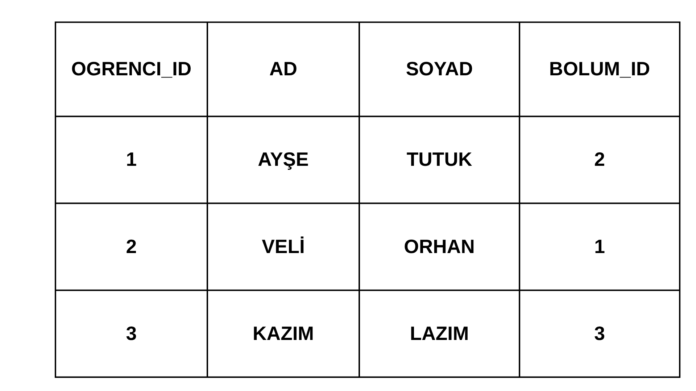
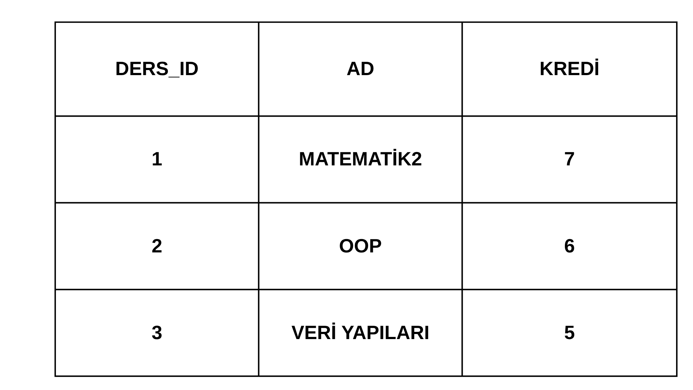
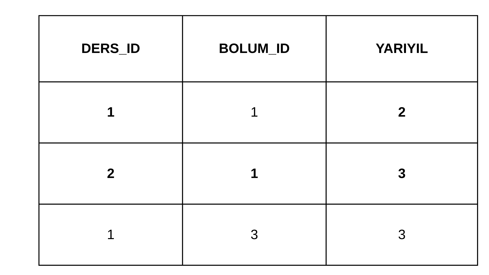
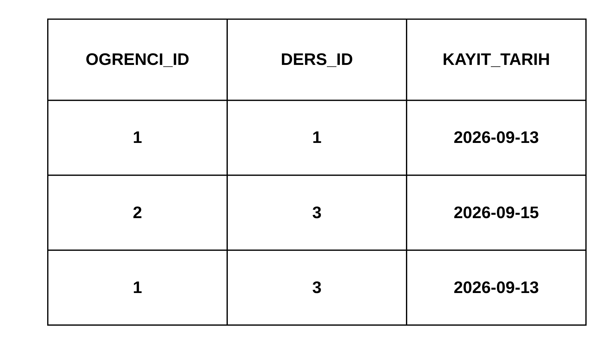

## 17 Eylül Ödevi

#### Görev 1.1: 3NF
>Öğrenci, Bölüm ve Ders ilişkilerini 3NF kurallarına uygun olarak normalize edip DDL sorgularını yazın.

#### Açıklama:
>Öğrenci, Bölüm ve Ders ilişkilerini 3NF kurallarına uygun olarak normalize edip DDL sorgularını yazın.

#### 1.Varlıklar(Tablolar) arası ilişkiler

#### 1.1.Bölüm-Öğrenci
>1-N: Bir bölümde birden fazla öğrenci bulunabilir. Her öğrenci yalnızca bir bölüme bağlıdır.

#### 1.2.Bölüm-Ders
>M-N: Bir bölümün birden fazla dersi olabilir. Bir ders birçok bölümde verilebilir.

>Örnek : Bilgisayar Mühendisliği Bölümü : Mat2,Algoritmalar
>Elektirik-Elektronik Mühendisliği : Mat2, EMA,Lineer Cebir

>Burada M-N ilişkisi bolum_ders ara tablosuyla çözülebilir.

#### 1.3.Öğrenci-Ders
>M-N: Bir öğrencinin birden fazla dersi olabilir. Bir ders birden çok öğrenci tarafından alınabilir.

>Örnek: Ali->  Mat2,Veri Yapıları, Veri Tabanı. Ayşe-> Mat2,Fizik2,Nesneye Yönelik Programlama

>Burada M-N ilişkisi ders_kaydi ara tablosuyla çözülebilir.

#### 2.TABLOLAR

#### 2.1.Bölüm Tablosu

>Sadece bölümün kendisine ait alanlar tabloda tanımlanmıştır. Her bir kaydın/satırın birbirinden benzersiz olması için PK olarak BolumId tanımlanmıştır. İlgili tabloya Şekil 1'de yer verilmiştir.

  
  <figcaption>Şekil 1.Bölüm Tablosu<figcaption>             

#### 2.2.Öğrenci Tablosu

>Öğrenci tablosunda her satırın birbirinden bağımsız olması için öğrenci_id pk olarak belirlendi. Aynı zamanda tabloda verilen alanların yalnızca birincil anahtara bağımlılığı doğrulandı. İlgili tabloya Şekil 2'de yer verilmiştir.

  
    <figcaption>Şekil 2.Öğrenci Tablosu<figcaption>             

#### 2.3.Ders Tablosu
>Ders tablosuna Şekil 3'de yer verilmiştir.

  
  <figcaption>Şekil 3.Ders Tablosu<figcaption>             

#### 2.4.Bölüm_Ders Tablosu
>Hangi dersin hangi bölümlerde okutulduğunu gösteren çoka çok (M:N) çözüm tablosudur. Matematik II dersinin hem Bilgisayar Mühendisliğinde hem de Elektrik-Elektronik Mühendisliğinde yer almasını bu tablo sağlar. Bu durumu sağlayan tabloya Şekil 4'te yer verilmiştir.

  
 <figcaption>Şekil 4.Bolum-Ders Tablosu<figcaption>             

#### 2.5.Öğrenci-Ders Tablosu
> Bir öğrencinin birden fazla ders alabilmesini ve bir dersin birden fazla öğrenci tarafından seçilebilmesini sağlayan bağlantı (kesişim) tablosudur. Öğrenciler ve dersler arasındaki bu "çoka çok" ilişkiyi veri tekrarına yol açmadan çözer.İlgili tabloya Şekil 5'te yer verilmiştir.

  
  <figcaption>Şekil 5.Öğrenci-Ders Tablosu<figcaption>             

#### 3.Veri Bütünlüğü ve İlişkisel Kısıtlamalar

>Sistemin veri tabanı mimarisinde, tablolar arası ilişkiler kurulurken  kritik verilerin yanlışlıkla silinmesini engellemek amacıyla referans bütünlüğü kısıtlamaları uygulanmıştır. Bu  doğrultuda RESTRICT  ve CASCADE stratejileri kullanılmıştır.

#### 3.1. Korumalı Silme Kuralları (ON DELETE RESTRICT)

>Öğrenci-Bölüm Bütünlüğü: ogrenci tablosu bolum tablosuna RESTRICT kuralı ile bağlıdır. Sistemde aktif olarak kayıtlı en az bir öğrencisi bulunan hiçbir bölüm veritabanından silinemez. Bu kısıtlama, öğrencilerin sistemsel olarak boşlukta (bölümsüz) kalmasını önler.

>ogrenci_ders tablosunda kaydı bulunan, yani geçmişte veya güncel dönemde en az bir öğrenci tarafından seçilmiş bir ders (ders tablosundan) silinemez. Bu sayede, öğrencilerin transkript ve geçmiş not kayıtlarının bozulması teknik olarak imkansız hale getirilmiştir.

#### 3.2. Zincirleme Silme Kuralları (ON DELETE CASCADE)
>Bir ana veri kasıtlı ve kontrollü olarak silindiğinde, veritabanında "çöp/işlevsiz veri" kalmaması için CASCADE kuralı tercih edilmiştir:

>Öğrenci İlişiğinin Kesilmesi: Bir öğrencinin kaydı sistemden kalıcı olarak silindiğinde (ogrenci tablosundan), o öğrencinin geçmişte aldığı tüm ders kayıtları ve ders eşleşmeleri (ogrenci_ders tablosundan) veri tabanı tarafından otomatik olarak silinir. Olmayan bir öğrencinin not bilgisinin sistemde yer kaplaması engellenir.

>Eğer bir bölüm tamamen kapatılıp silinirse (öncesinde tüm öğrencilerin transfer edildiği varsayılarak), o bölüme atanmış olan ders müfredat eşleşmeleri de (bolum_ders tablosundan) otomatik olarak temizlenerek veri kirliliğinin önüne geçilir.